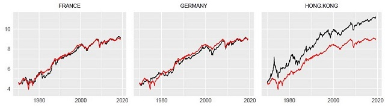

## Studying the Stationarity of Relative Stock Prices
Comparing the stock index of 23 countries (using MSCI data) against both the U.S. and U.K. stock indices  
  
- **Goal**: determine whether the country's stock index is mean reverting relative to the US or UK (that is, large price divergences from each other are temporary)
- **Methodology**: Test connection between 23 OECD countries to both USA and UK, using Augmented Dickey-Fuller (linear) and ESTAR (nonlinear) unit root tests with only one lag variable.
  - the test for stationarity is a t-test on the fitted model's coefficient using t-value tables from Balvers et al. and Kapetanios et al., respectively
  - relative stock prices: `rel_price(country) = ln(country_stock_price) - ln(USA_stock_price)` ... natural log taken to correct for exponential time trend
- **Conclusion**: Some OECD countries do exhibit statistically significant long-term stationarity with the USA and UK, especially Hong Kong. France, Germany, Belgium, and Norway are stationary with the UK. 
---
### Country MSCI Index vs. USA Index
- **red = USA MSCI stock index**

### Country MSCI Index vs. UK Index
- **red = USA MSCI stock index**

### Statistical Tests for Country MSCI Index vs. USA Index
- **shows that the US market is stationary with Hong Kong, Norway, the UK, and France**
- 

